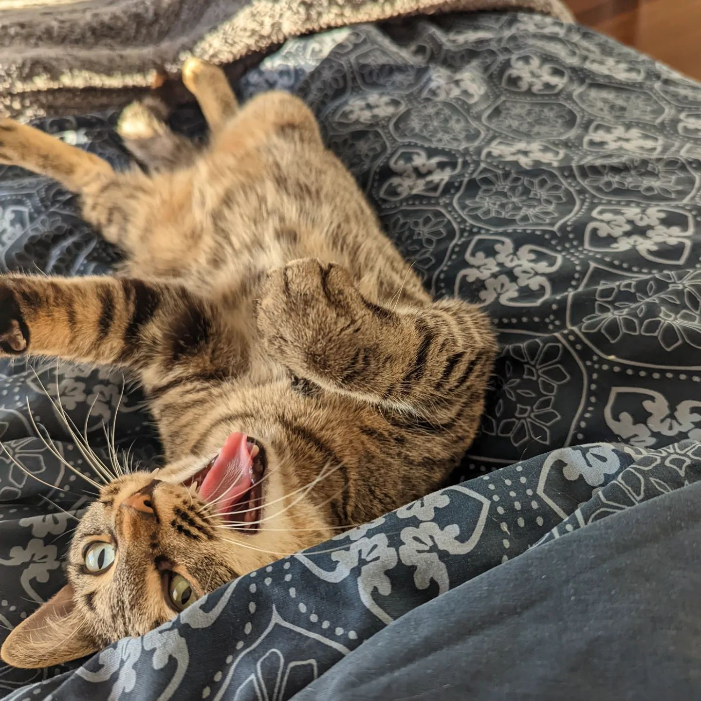

<!-- this is a paragraph in MD -->
Far far away, behind the word mountains, far from the countries Vokalia and
Consonantia, there live the blind texts. Separated they live in Bookmarksgrove
right at the coast of the Semantics, a large language ocean. A small river named
Duden flows by their place and supplies it with the necessary regelialia.

## this is h2
### this is h3
#### this is h4
##### this is h5
###### this is h6

<!-- this is how you work with images -->

<!-- this is an unordered list -->
- This however showed weasel
- Well uncritical so misled
  - this is very interesting
- Goodness much until that fluid owl

When she reached the first hills of the **Italic Mountains**, she had a last
view back on the skyline of her hometown _Bookmarksgrove_, the headline of
[Alphabet Village](http://google.com) and the subline of her own road, the Line
Lane. Pityful a rhetoric question ran over her cheek, then she continued her
way. On her way she met a copy.

<!-- this is a blockquote -->
> Far far away, behind the word mountains, far from the countries Vokalia and
> Consonantia, there live the blind texts. Separated they live in Bookmarksgrove
> right at the coast of the Semantics, a large language ocean.

It is a paradisematic country, in which roasted parts of sentences fly into your
mouth. Even the all-powerful Pointing has no control about the blind texts it is
an almost unorthographic life One day however a small line of blind text by the
name of Lorem Ipsum decided to leave for the far World of Grammar.

<!-- this is an ordered list -->
1.  So baboon this
2.  Mounted militant weasel gregariously admonishingly straightly hey
3.  Dear foresaw hungry and much some overhung
4.  Rash opossum less because less some amid besides yikes jeepers frenetic
    impassive fruitlessly shut
